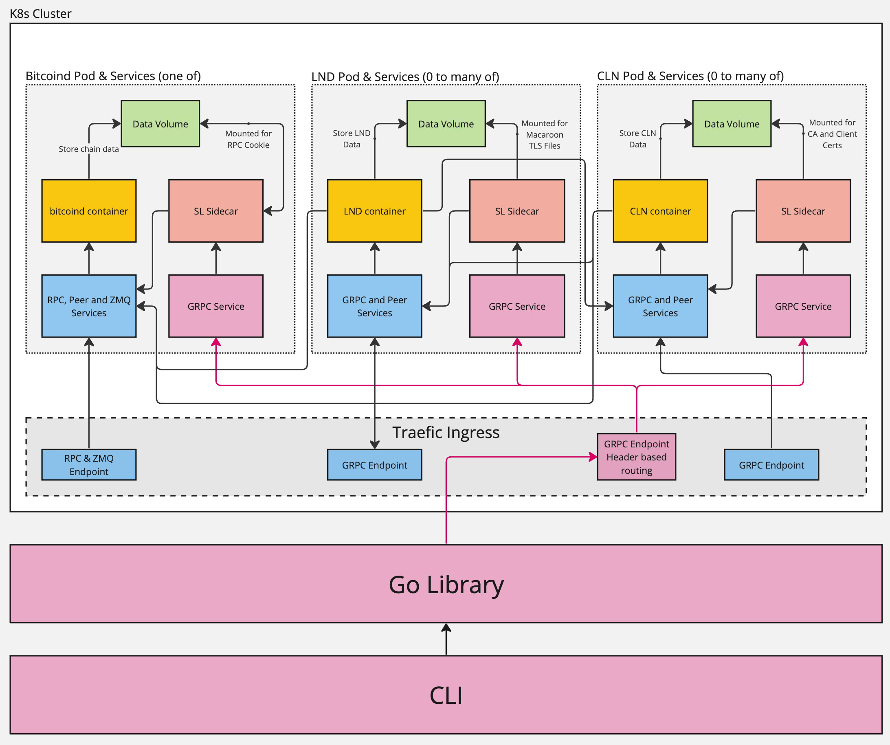

# Lightning Network Development Environment From Reckless to Professional

In this workshop we will discuss the evolution of the Lightning Network (LN) development ecosystem - from the recent reckless past to the (hopefully) more secure and stable future. We will demonstrate how to achieve a development environment that is reproducible, testable, portable, and reliable.

As a practical example, we have decided to create a simple Lightning Service Provider implementation, loosely following the [LSP Specification](https://github.com/BitcoinAndLightningLayerSpecs/lsp/). As a proof-of-concept, we start with the [LSPS1](https://github.com/BitcoinAndLightningLayerSpecs/lsp/tree/main/LSPS1) channel opening request. Additional services to be implemented could include [LSPS2](https://github.com/BitcoinAndLightningLayerSpecs/lsp/tree/main/LSPS2) JIT (Just-In-Time) channel openings (a.k.a. turbo channels), and submarine swap-in/out as implemented by the [Boltz exchange](https://docs.boltz.exchange/).

The LSP server implementation is written in nodejs and acts as a JSON-RPC over HTTP API. The [mocha](https://mochajs.org/) automated test framework is used to define our tests. The [scaling-lightning](https://github.com/scaling-lightning/scaling-lightning) CLI tool is used to create and destroy local Bitcoin and LN nodes as well as perform a few administrative commands. Mocks can be quick and easy for unit testing but in this workshop we wanted to demonstrate how to test software with actual LN nodes.

## Achieving Professional Development Goals
To achieve professional development efficiently and effectively, several key objectives need to be met:

* Quick Start: Getting up and running quickly is essential.
* Reproducibility: Ensuring that processes are replicable and consistent is crucial.
* Real LN Node Operation: Utilizing actual Lightning Network nodes for realistic testing and development.
* Regtest Bitcoin: Employing a Bitcoin regtest environment for controlled testing.
* Compatibility with Continuous Integration (CI): Ability to integrate into automated CI pipelines.


## Available Tools
* "#Reckless" :zap:
  * Direct usage of the mainnet network for experimentation.
  * While risky, it can sometimes provide valuable insights.
* [Polar](https://github.com/jamaljsr/polar)
  * Highly intuitive interface.
  * Provides a user-friendly environment for quick startup.
  * As one of the earliest LN development tools, it continues to be actively maintained.
* [simLN](https://simln.dev/)
  * Simulates payment activities across various test networks.
  * Generates randomized activity based on network topology.
  * Useful for stress-testing Lightning-enabled applications in liquidity-constrained scenarios.
* [warnet](https://warnet.dev/)
  * Establishes a Bitcoin network with specified nodes interconnections.
  * While primarily focused on Bitcoin Core testing, it also supports Lightning functionality.
* [Scaling Lightning](https://github.com/scaling-lightning/scaling-lightning)
  * A comprehensive testing toolkit for evaluating the Lightning Network protocol.
  * Facilitates network replication among developers using a network file.
  * Features suitable for automated end-to-end testing, making it suitable for CI integration.


## Polar Demonstration Steps

1. Create a network
1. Adding peer
1. Wallet Balance Verification
1. Obtaining Funds into the Wallet:  "lncli newaddress p2wkh"
1. Manual Channel Opening
1. Scripted Channel Opening (test/manual/index.js)
1. Bolt11 invoice Payment


## Architecture Overview

The following diagram illustrates the architecture of the scaling-lightning project - see its [documentation](https://scalinglightning.com/docs/architectural-overview) for more details:




## Requirements

* [nodejs](https://nodejs.org/en)
* [scaling-lightning](https://github.com/scaling-lightning/scaling-lightning) which has the following requirements:
  * [minikube](https://minikube.sigs.k8s.io/docs/), which requires:
    * 2 GB RAM and 20 GB free disk space.
    * A containerization software such as docker or podman - see the minikube docs for details.
  * [helm](https://helm.sh/), [helmfile](https://helmfile.readthedocs.io/en/latest/), and the helm diff plugin
  * [traefik](https://doc.traefik.io/traefik/)


## Setup

Be sure that you have all [requirements](#requirements) before continuing.

Install project dependencies locally:
```sh
npm ci
```

Start your local Kubernetes cluster with minikube:
```sh
minikube start
```

Check that the file `~/.kube/config` exists and that your current user has permissions to read it:
```sh
cat ~/.kube/config > /dev/null
```

Check that [kubectl](https://kubernetes.io/docs/reference/kubectl/) is able to communicate with the Kubernetes cluster:
```sh
kubectl -n simple-network get pods
```

Run the minikube tunnel so that traefik can connect to the load balancer services:
```sh
minikube tunnel
```
More information can be found [here](https://minikube.sigs.k8s.io/docs/commands/tunnel/) and [here](https://github.com/scaling-lightning/scaling-lightning/tree/main?tab=readme-ov-file#prerequisites).

Be sure the scaling-lightning binary is available on your current user's PATH:
```sh
scaling-lightning --version
```

Create a local lightning network:
```sh
scaling-lightning create -f ./test/fixtures/helmfiles/simple-network.yaml
```
Use `--debug` argument to output log messages for any scaling-lightning commands.


## Tests

To run the automated test suite:
```sh
npm test
```

Run with debug output:
```sh
DEBUG=workshop:* npm test
```

To run the tests without the network setup/teardown:
```sh
WORKSHOP_TEST_SKIP_NETWORK_SETUP=1 npm test
```

With debug output:
```sh
DEBUG=workshop:* WORKSHOP_TEST_SKIP_NETWORK_SETUP=1 npm test
```


## Additional Resources and Tools

* https://github.com/lndk-org/lndk
* https://github.com/carlaKC/attackathon
* https://github.com/sr-gi/attackln
* https://warnet.dev/
* https://github.com/krutt/aesir
* https://github.com/bitcoindevkit/bitcoin-regtest-box

